# Scalability: Horizontal vs Vertical Scaling

*A zero-to-mastery guide for system design interviews and real-world architecture.*

---

## Table of Contents
1. [What Is Scalability?](#1-what-is-scalability)
2. [The Two Ways to Scale](#2-the-two-ways-to-scale)
3. [Vertical Scaling (Scale Up)](#3-vertical-scaling-scale-up)
4. [Horizontal Scaling (Scale Out)](#4-horizontal-scaling-scale-out)
5. [Side-by-Side Comparison](#5-side-by-side-comparison)
6. [The Hidden Prerequisite: Statelessness](#6-the-hidden-prerequisite-statelessness)
7. [Real System Evolution: Small App to Scaled App](#7-real-system-evolution-small-app-to-scaled-app)
8. [How to Reason About This in an Interview](#8-how-to-reason-about-this-in-an-interview)
9. [Quick Recall Cheat Sheet](#9-quick-recall-cheat-sheet)

---

## 1. What Is Scalability?

**Scalability** is a system's ability to handle a growing amount of work — more users, more requests, more data — by adding resources, without falling over or slowing to a crawl.

Think of a single-lane road with one toll booth. On a quiet Sunday it works fine. On a holiday weekend, cars back up for miles. You have exactly two options to fix this:

- Make the **existing** toll booth process cars faster (upgrade it).
- Add **more** toll booths (duplicate it).

That's the entire concept, in one metaphor. Everything below is just the engineering detail behind those two options.

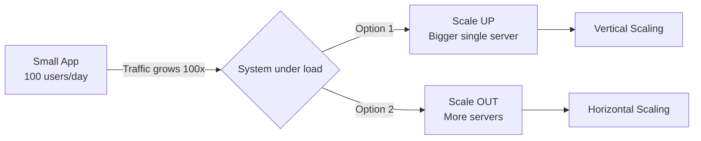

---

## 2. The Two Ways to Scale

| | Vertical Scaling | Horizontal Scaling |
|---|---|---|
| **What changes** | The power of **one** machine | The **number** of machines |
| **Analogy** | Upgrading one toll booth to be faster | Adding more toll booths |
| **Also called** | Scale Up | Scale Out |

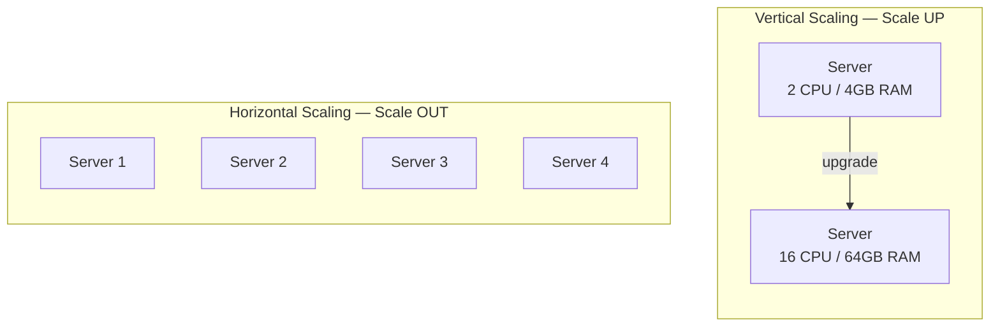

---

## 3. Vertical Scaling (Scale Up)

### The idea
You take your **single existing server** and give it more power: more CPU cores, more RAM, faster SSDs, better network cards. The application code doesn't change at all — it's still one machine, just a beefier one.

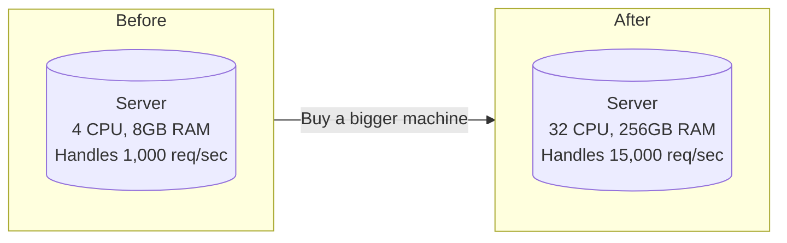

### How it plays out in an architecture

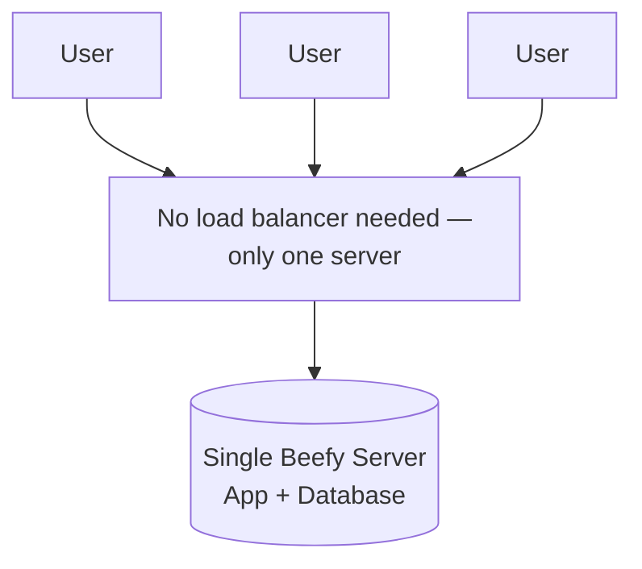

### Why it's tempting
- **Zero code changes.** Your app was written assuming "one server, one database" — that assumption still holds.
- **No distributed-systems problems.** No data-consistency issues, no network partitions between nodes, no need to synchronize state across machines.
- **Simple to reason about.** One machine, one log file, one place to SSH into and debug.

### Why it breaks down
- **Hard physical ceiling.** There's a maximum CPU/RAM you can put in one box. Even the biggest cloud instance (e.g., AWS's largest) has a limit — you *will* hit it if you grow enough.
- **Single Point of Failure (SPOF).** If that one server crashes, your entire system goes down. There's no redundancy.
- **Downtime during upgrades.** Adding RAM or swapping a CPU usually means stopping the machine.
- **Cost grows non-linearly.** Doubling a server's specs often costs far more than 2x the price — high-end hardware carries a premium.

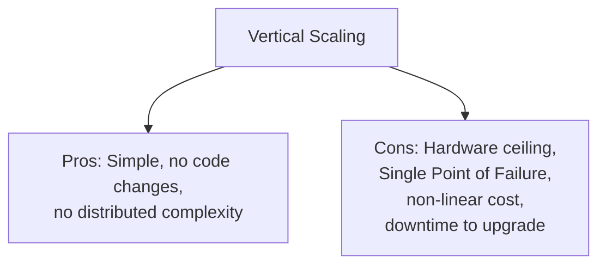

---

## 4. Horizontal Scaling (Scale Out)

### The idea
Instead of making one server bigger, you run the **same application on many servers** and spread incoming traffic across them using a **load balancer**.

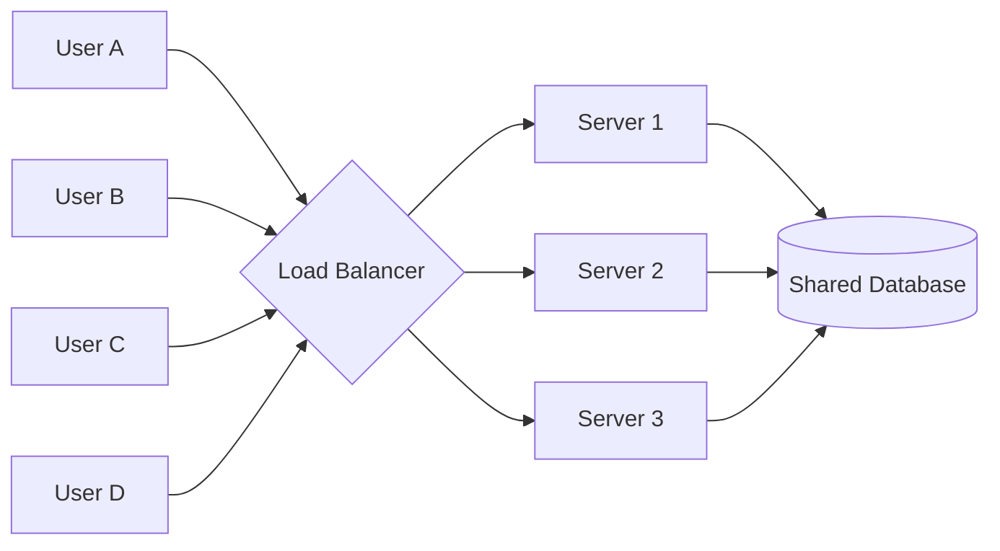

### What happens when traffic grows further
You just add another box. No single machine needs to get more powerful — the *group* gets bigger.

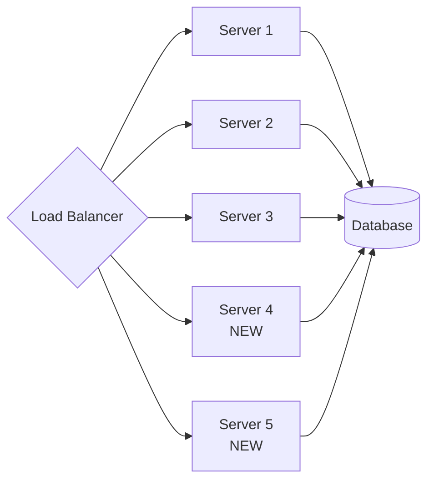

### Why it wins at scale
- **No hard ceiling.** Need more capacity? Add another commodity server. In theory this continues indefinitely.
- **Built-in redundancy.** If Server 2 dies, the load balancer just stops sending it traffic — Servers 1, 3, 4, 5 keep the app alive. No SPOF at the application tier.
- **Cost scales more linearly**, often using cheap, commodity hardware or cloud instances rather than premium high-end boxes.
- **Zero-downtime scaling.** You can add or remove servers while the system keeps running.

### Why it's harder
- **Requires a load balancer** — a new component, and itself something you must design to not become a bottleneck/SPOF.
- **The application must be stateless** (explained in detail in Section 6) — if a server remembers a user's session in local memory, a load balancer sending that user's next request to a *different* server breaks things.
- **The database usually becomes the next bottleneck.** Adding app servers is easy; scaling the shared database behind them is a much harder problem (replication, sharding — separate topics).
- **Operational complexity.** Now you have deployment orchestration, service discovery, distributed logging/monitoring, and network calls between components that can fail independently.

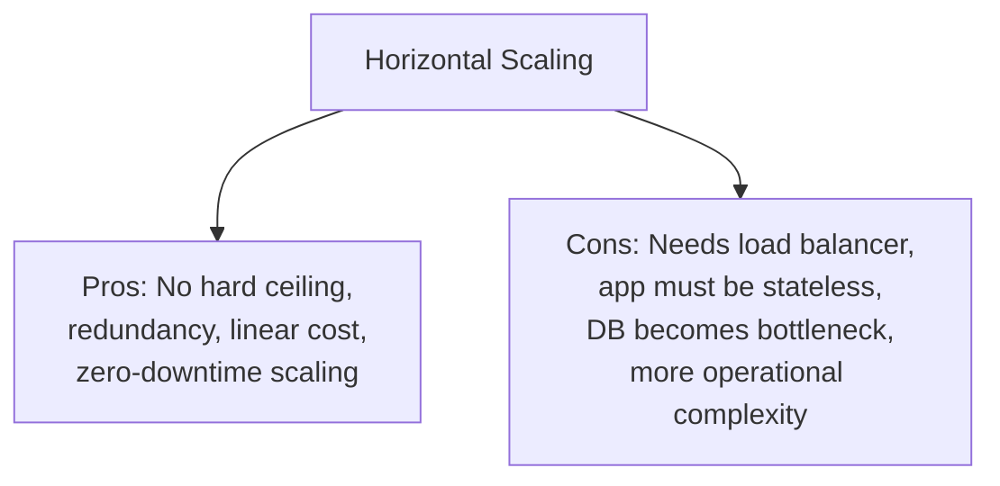

---

## 5. Side-by-Side Comparison

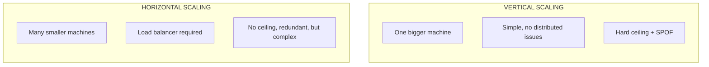

| Dimension | Vertical Scaling | Horizontal Scaling |
|---|---|---|
| **How you grow** | Upgrade the one machine (more CPU/RAM) | Add more machines |
| **Upper limit** | Hard ceiling (hardware maximum) | Practically unlimited |
| **Fault tolerance** | Single point of failure | Redundant — one node dying doesn't kill the system |
| **Code complexity** | None needed | App must be stateless; needs load balancing |
| **Cost curve** | Non-linear, gets expensive fast at the high end | More linear; can use cheap commodity machines |
| **Downtime to scale** | Often requires downtime/reboot | Can scale live, with zero downtime |
| **Operational complexity** | Low (one box to manage) | Higher (many boxes, LB, service discovery, monitoring) |
| **Best for** | Early-stage apps, databases that are hard to distribute, quick fixes | Web-scale systems, unpredictable/spiky traffic, high-availability needs |

---

## 6. The Hidden Prerequisite: Statelessness

This is the single most important idea that separates "horizontal scaling works" from "horizontal scaling silently breaks your app."

**Stateful server** — remembers something about a specific user in its own local memory (e.g., "User A is logged in" stored in that server's RAM). If the load balancer sends User A's *next* request to a different server, that server has never heard of User A — they get logged out or see broken behavior.

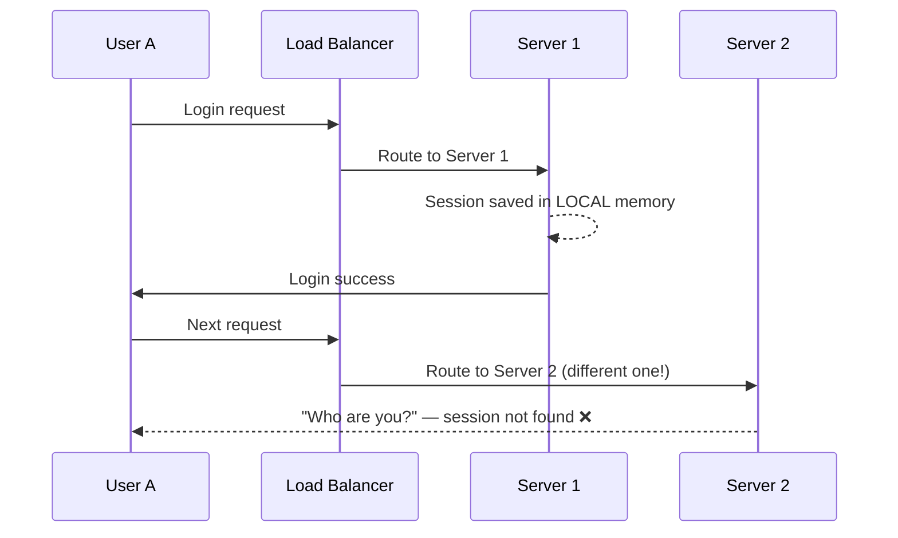

**Stateless server** — keeps no user-specific memory of its own. Session/user data lives in a **shared** store (like Redis) that every server can read, so it doesn't matter which server handles which request.

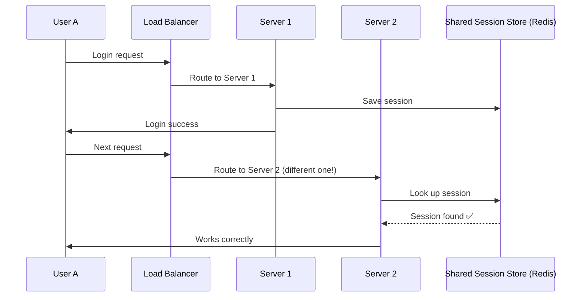

**Takeaway:** Horizontal scaling of the *application tier* is only painless once servers are stateless. This is why real-world horizontally-scaled systems push session data, uploaded files, and similar state out of individual servers and into shared services (Redis, S3, a database) — this is a design decision, not something that happens automatically.

---

## 7. Real System Evolution: Small App to Scaled App

Let's walk through how a real system typically evolves — this is exactly the kind of progression an interviewer wants you to be able to narrate.

**Stage 1 — Day 1 launch.** One server does everything: app code and database, together.

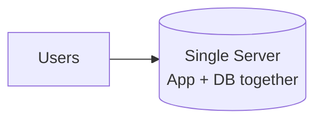

**Stage 2 — Vertical scaling first.** Traffic grows a bit. The cheapest, fastest fix is to just get a bigger box. This buys time without touching architecture.

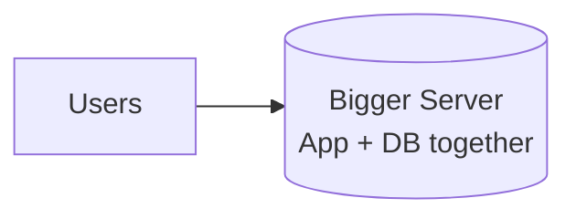

**Stage 3 — Split app and database, then scale the app horizontally.** Once vertical scaling hits diminishing returns, the app tier is separated from the database and duplicated behind a load balancer. The app tier is made stateless.

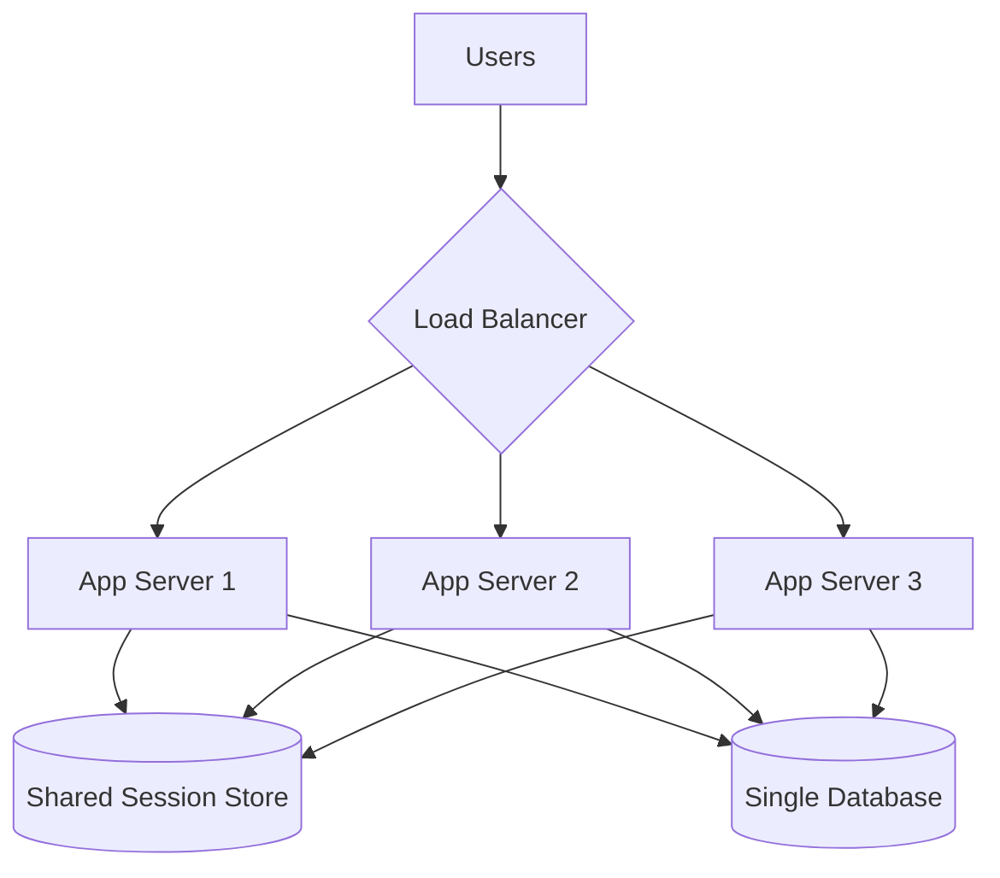

**Stage 4 — The database becomes the bottleneck next.** This is a different problem (replication / sharding — beyond today's topic), but it's the natural next question an interviewer will ask once you've horizontally scaled the app tier.

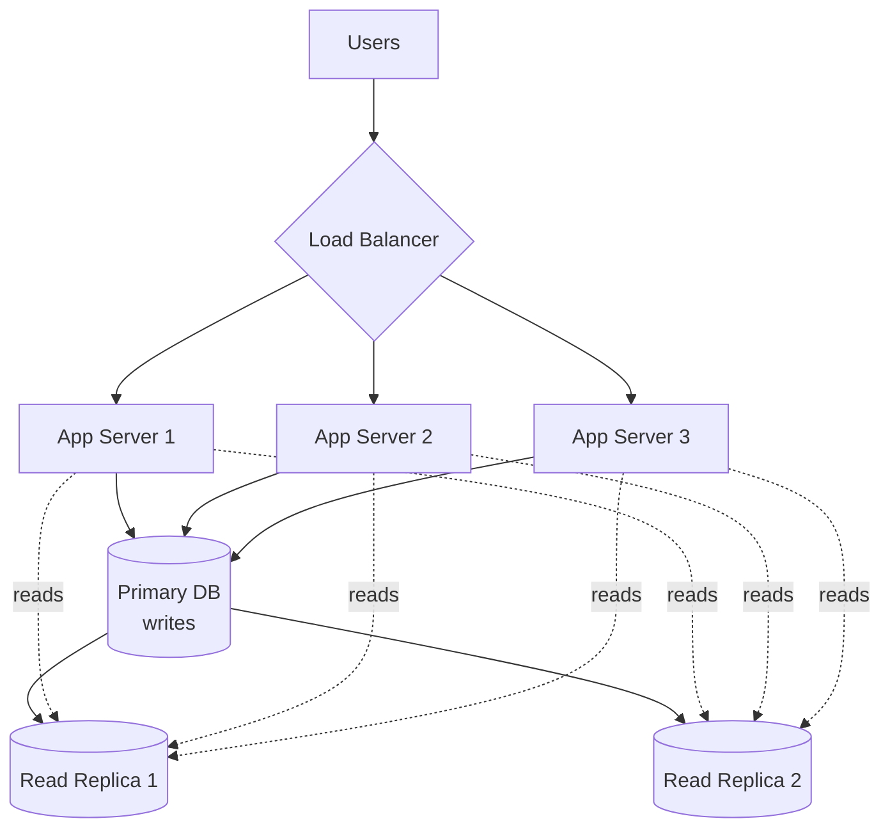

*(Database replication/sharding is its own deep topic — flag it as "the next bottleneck" when discussing this in an interview, even if you don't dive into it.)*

---

## 8. How to Reason About This in an Interview

If asked *"how would you scale this system?"*, don't just say "horizontally, obviously." A strong answer sounds like this:

> "I'd start by identifying *what's* the bottleneck — is it CPU-bound compute, is it the database, or is it just raw request volume? If it's early-stage and traffic is modest, vertical scaling is the fastest, cheapest fix — no architecture changes needed. But it doesn't scale indefinitely and creates a single point of failure. So as we grow, I'd move to horizontal scaling for the application tier — which means putting a load balancer in front, and critically, making the app servers stateless by moving session data into a shared store like Redis. Once that's done, the database usually becomes the next bottleneck, which I'd address separately with replication or sharding depending on the read/write pattern."

That answer demonstrates: knowing both options, knowing the *order* people typically apply them in, knowing the *hidden prerequisite* (statelessness), and knowing what breaks *next*.

---

## 9. Quick Recall Cheat Sheet

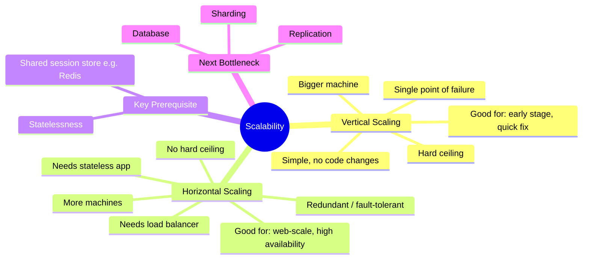

| If you remember only 5 things |
|---|
| 1. Vertical = one machine gets bigger. Horizontal = more machines get added. |
| 2. Vertical is simpler but has a hard ceiling and is a single point of failure. |
| 3. Horizontal has no real ceiling and is fault-tolerant, but needs a load balancer. |
| 4. Horizontal scaling **only works cleanly if the app is stateless** — this is the #1 gotcha. |
| 5. Real systems usually scale vertically first (cheap, fast), then horizontally (when the ceiling is hit), and the database becomes the next bottleneck after the app tier is solved. |

---

