# Load Balancing: Algorithms & Why It's Needed

*Day 2 of the System Design series — a zero-to-mastery guide.*

---

## Table of Contents
1. [What Is a Load Balancer?](#1-what-is-a-load-balancer)
2. [Why It's Needed](#2-why-its-needed)
3. [Where a Load Balancer Sits](#3-where-a-load-balancer-sits)
4. [Load Balancing Algorithms](#4-load-balancing-algorithms)
5. [Layer 4 vs Layer 7 Load Balancing](#5-layer-4-vs-layer-7-load-balancing)
6. [Health Checks: How the LB Knows a Server Is Dead](#6-health-checks-how-the-lb-knows-a-server-is-dead)
7. [The Load Balancer Is Also a Single Point of Failure](#7-the-load-balancer-is-also-a-single-point-of-failure)
8. [How to Reason About This in an Interview](#8-how-to-reason-about-this-in-an-interview)
9. [Quick Recall Cheat Sheet](#9-quick-recall-cheat-sheet)

---

## 1. What Is a Load Balancer?

A **load balancer (LB)** is a component that sits in front of a group of servers and decides which server handles each incoming request.

Think of it like the host at a busy restaurant. Customers don't pick their own table — the host looks at which tables are free (or least busy) and directs each new customer there. Without the host, everyone would rush to the same one table while five others sit empty.

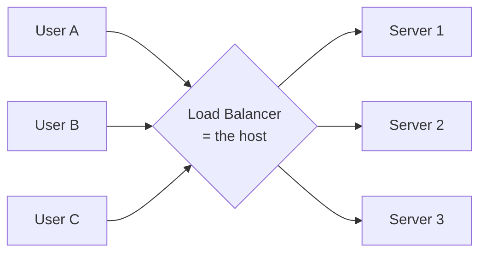

---

## 2. Why It's Needed

Recall from Day 1: horizontal scaling means running your app on **multiple servers**. But multiple servers alone don't help if all the traffic still gets sent to just one of them. You need something to actually **distribute** the requests. That's the load balancer's entire job.

### Without a load balancer

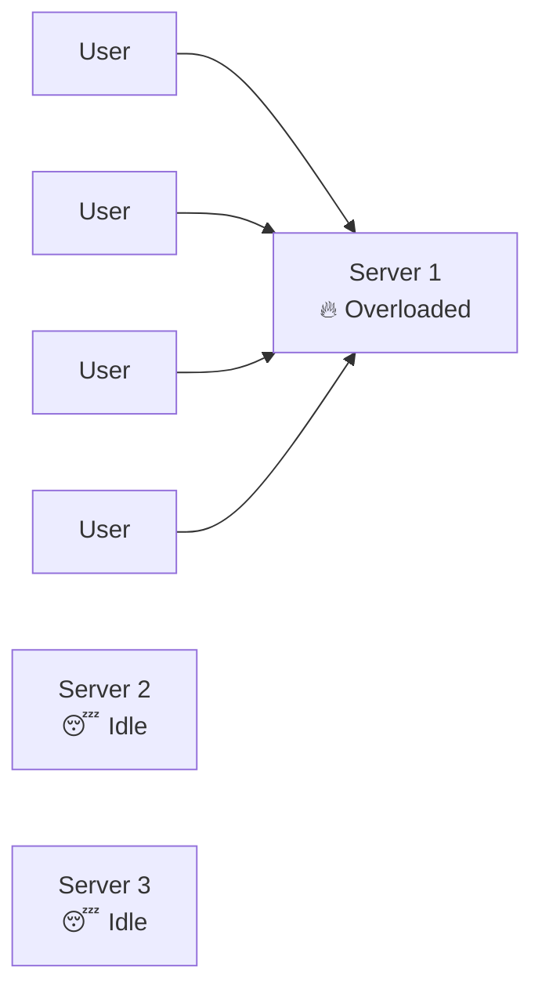

All requests are hammering Server 1 (maybe because that's the only IP address clients know), while Servers 2 and 3 sit completely unused. This defeats the entire purpose of having multiple servers.

### With a load balancer

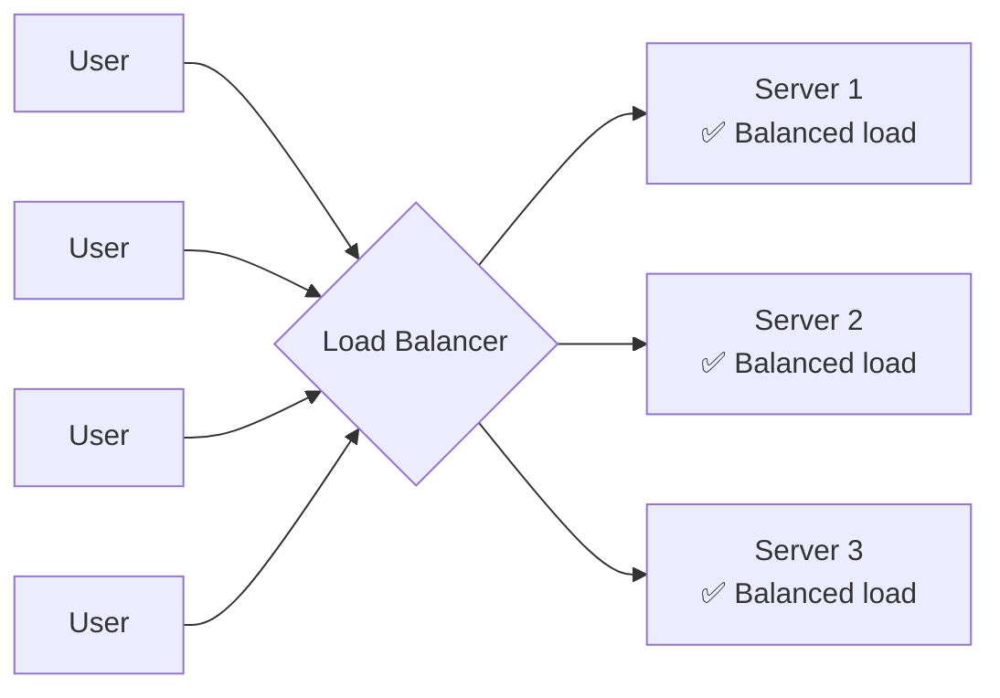

### The core reasons you need one

- **Even distribution** — no server gets overwhelmed while others idle.
- **High availability** — if one server crashes, the LB stops sending it traffic and routes around it; users don't notice.
- **Scalability** — you can add or remove servers behind the LB without changing anything the client sees (the client only ever talks to the LB's address).
- **A single entry point** — clients don't need to know about 20 backend servers; they just talk to one stable address.

---

## 3. Where a Load Balancer Sits

A load balancer can be placed at multiple points in a system, not just "in front of the app servers." Two very common placements:

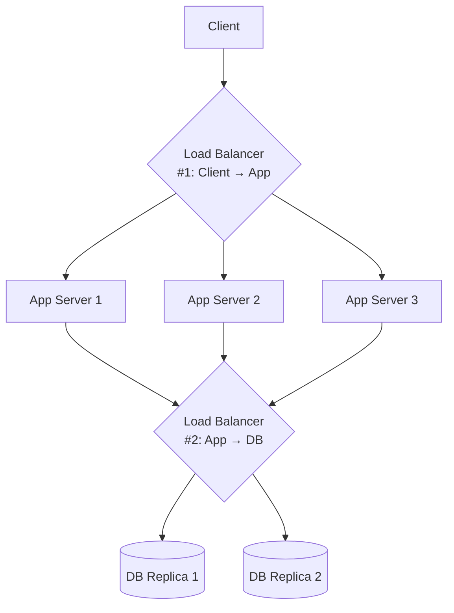

This shows load balancing happening **twice**: once between users and app servers, and again between app servers and database read replicas. In real systems, load balancers show up wherever one tier talks to a scaled-out group of servers behind it.

---

## 4. Load Balancing Algorithms

This is the "brain" of the load balancer — the rule it uses to decide *which* server gets the next request.

### 4.1 Round Robin
Requests are handed out to servers in strict rotating order: 1, 2, 3, 1, 2, 3...

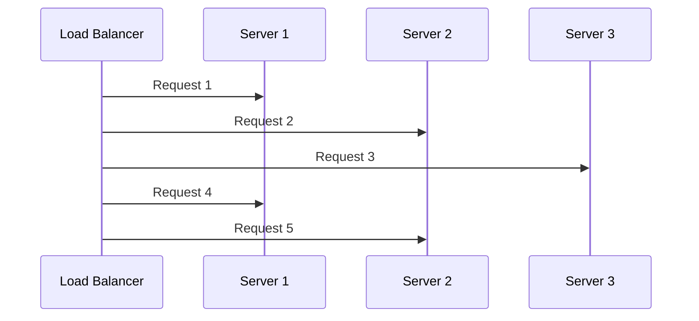

- **Good for:** servers with roughly equal capacity and requests that take roughly equal time.
- **Weak point:** if Server 1 gets a request that takes 10 seconds while others take 100ms, Round Robin doesn't care — it'll still blindly send Server 1 the next request in line, even though it's still busy.

### 4.2 Weighted Round Robin
Same rotation idea, but stronger servers get proportionally more requests. A server with weight 3 gets 3 requests for every 1 the weight-1 servers get.

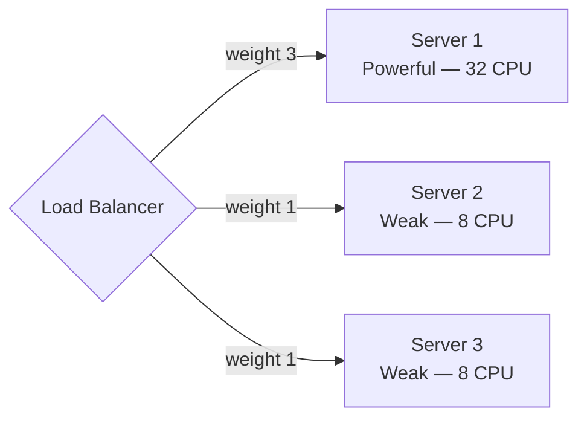

- **Good for:** a mixed fleet of servers with different hardware specs.

### 4.3 Least Connections
Send the next request to whichever server currently has the **fewest active connections** — i.e., whoever is least busy right now.

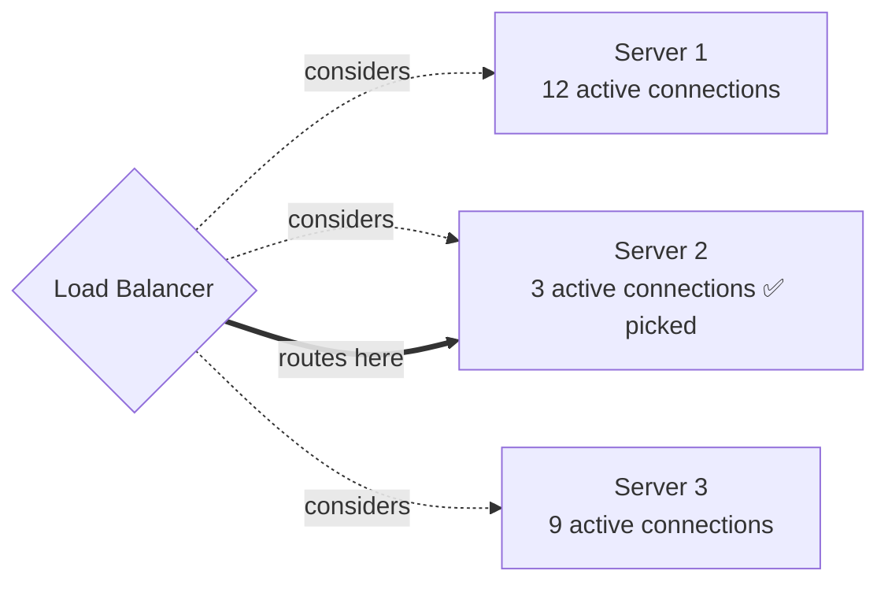

- **Good for:** requests that take varying amounts of time to process — this is smarter than Round Robin because it reacts to real-time load, not just a fixed rotation.

### 4.4 Least Response Time
Like Least Connections, but also factors in how fast each server has been responding recently. Picks the server with the best combination of low connection count **and** low latency.

- **Good for:** systems where you care about actual user-perceived speed, not just raw connection count.

### 4.5 IP Hash
The load balancer runs the client's IP address through a hash function, and the result deterministically maps to the same server every time.

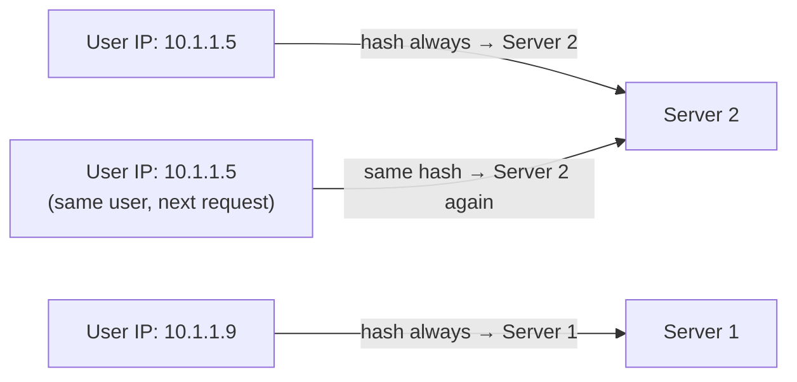

- **Good for:** "sticky sessions" — the same user always lands on the same server. Useful if a server does keep some local state (e.g., an in-memory cache warmed for that user), though the better long-term fix is usually still making servers stateless (see Day 1).

### Algorithm comparison

| Algorithm | Decision Basis | Best For |
|---|---|---|
| Round Robin | Fixed rotation | Equal servers, equal-length requests |
| Weighted Round Robin | Rotation + server capacity | Mixed-power server fleet |
| Least Connections | Current active load | Variable-length requests |
| Least Response Time | Load + latency | User-perceived speed matters most |
| IP Hash | Client IP | Sticky sessions / session affinity |

---

## 5. Layer 4 vs Layer 7 Load Balancing

Load balancers can operate at different layers of the network stack — this determines *how much* information they can see and use to make decisions.

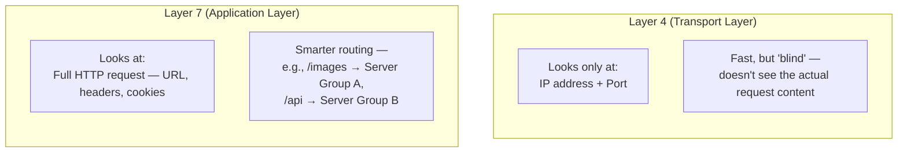

- **Layer 4 (L4):** Fast and simple — routes based on IP/port only, without opening up the actual request. Lower overhead, less "intelligent."
- **Layer 7 (L7):** Reads the actual HTTP request (URL path, headers, cookies) and can make content-aware routing decisions — e.g., sending all `/video` traffic to servers optimized for video, and everything else elsewhere.

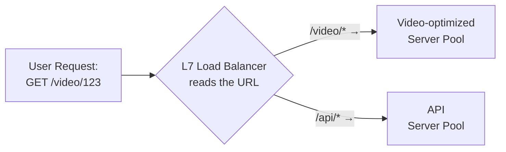

---

## 6. Health Checks: How the LB Knows a Server Is Dead

A load balancer is only useful if it stops sending traffic to servers that are down. It does this with **health checks** — periodic pings to each server (e.g., "hit `/health` every 5 seconds") to confirm it's alive and responsive.

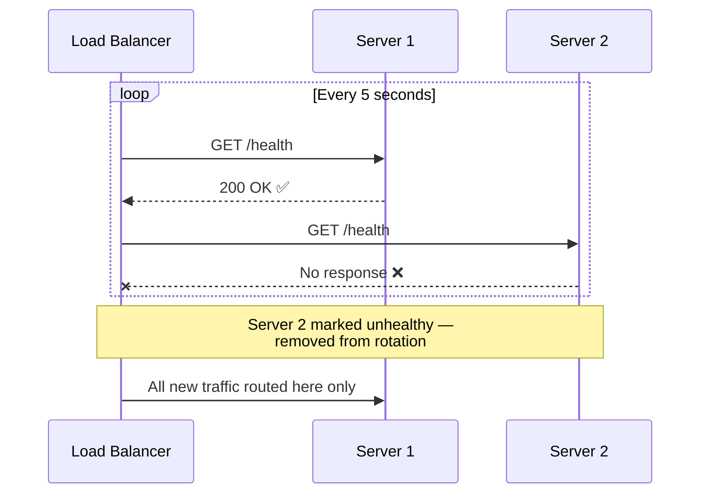

Once Server 2 responds normally again, the health check picks that up and the LB adds it back into rotation automatically — no human needs to intervene.

---

## 7. The Load Balancer Is Also a Single Point of Failure

Here's the twist that trips people up in interviews: you added a load balancer to remove the *app tier's* single point of failure — but now the **load balancer itself** is a single point of failure. If it goes down, no traffic reaches any app server, even if all of them are perfectly healthy.

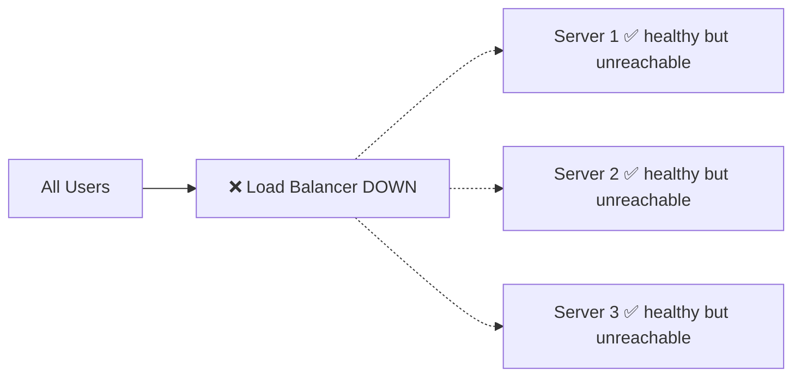

### The fix: redundant load balancers
Real-world systems run **at least two load balancers**, often in an active-passive setup, with something even more basic in front (like DNS or a floating IP) to fail over between them.

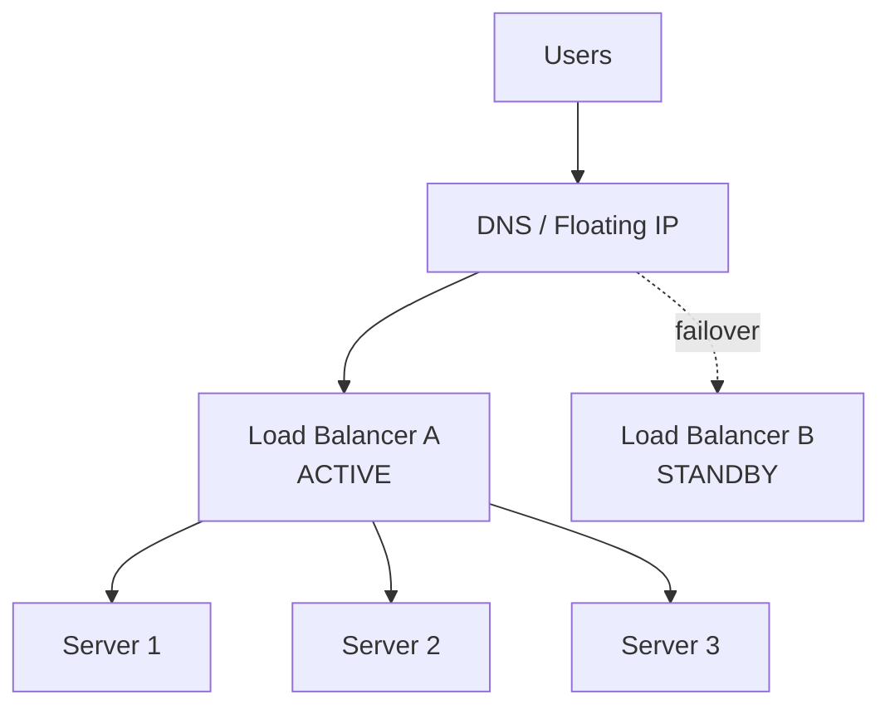

**Takeaway:** every layer you add to solve one single-point-of-failure problem can introduce a new one at the layer above it. This chain of reasoning — "what's the new bottleneck now?" — is exactly the muscle system design interviews are testing.

---

## 8. How to Reason About This in an Interview

If asked *"how would you distribute traffic across your servers?"*, a strong answer sounds like this:

> "I'd put a load balancer in front of the app servers so traffic doesn't all hit one instance. For the algorithm, if requests are roughly uniform in cost, Round Robin or Weighted Round Robin is enough — weighted if the servers aren't identical in capacity. If request processing time varies a lot, Least Connections handles that better since it reacts to real load rather than a fixed rotation. I'd also add health checks so the LB automatically stops routing to any server that goes down. And since the load balancer itself becomes a new single point of failure once it's the only path to my servers, I'd run at least two load balancers with a failover mechanism in front, rather than relying on just one."

That answer shows: you know *why* an LB is needed, you can pick an *appropriate algorithm* based on the traffic pattern (not just naming one), you know about *health checks*, and — critically — you catch that the **LB itself needs redundancy**.

---

## 9. Quick Recall Cheat Sheet

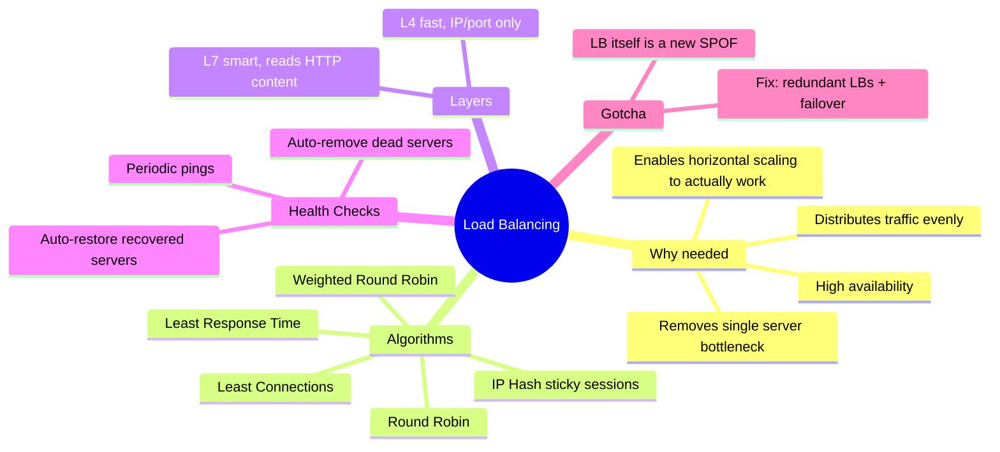

| If you remember only 5 things |
|---|
| 1. A load balancer's job is to distribute incoming requests across multiple servers. |
| 2. Without one, horizontal scaling is pointless — traffic just piles onto whichever server clients happen to hit. |
| 3. Pick the algorithm based on your traffic pattern: Round Robin for uniform load, Least Connections for variable-length requests, IP Hash for sticky sessions. |
| 4. Health checks let the LB automatically route around dead servers — and bring them back once they recover. |
| 5. The load balancer itself becomes a new single point of failure — production systems run redundant load balancers with failover. |

---

*This file is written in GitHub-flavored Markdown with Mermaid diagrams — it will render natively on GitHub, GitLab, and most modern Markdown viewers.*
