# Caching: Strategies & Eviction Policies (LRU and beyond)

*Day 3 of the System Design series — a zero-to-mastery guide.*

---

## Table of Contents
1. [What Is a Cache?](#1-what-is-a-cache)
2. [Why It's Needed](#2-why-its-needed)
3. [Where Caching Fits in a System](#3-where-caching-fits-in-a-system)
4. [Caching Strategies (Read Patterns)](#4-caching-strategies-read-patterns)
5. [Caching Strategies (Write Patterns)](#5-caching-strategies-write-patterns)
6. [Eviction Policies — What Happens When the Cache Is Full](#6-eviction-policies--what-happens-when-the-cache-is-full)
7. [LRU Deep Dive](#7-lru-deep-dive)
8. [The Big Risk: Stale & Inconsistent Data](#8-the-big-risk-stale--inconsistent-data)
9. [How to Reason About This in an Interview](#9-how-to-reason-about-this-in-an-interview)
10. [Quick Recall Cheat Sheet](#10-quick-recall-cheat-sheet)

---

## 1. What Is a Cache?

A **cache** is a small, fast storage layer that keeps a copy of frequently-used data close at hand, so you don't have to redo expensive work (like a slow database query) every single time.

Think of it like keeping a few frequently-used spices on your kitchen counter instead of walking to the pantry every time you cook. The pantry (database) has everything, but it's slower to reach. The counter (cache) only holds a handful of items, but grabbing them is instant.

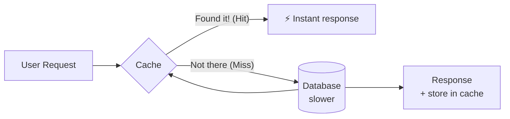

---

## 2. Why It's Needed

Databases are durable and can hold huge amounts of data, but reading from disk (or even doing a complex query) is **slow** relative to reading from memory. A cache typically lives in RAM, which is orders of magnitude faster than disk.

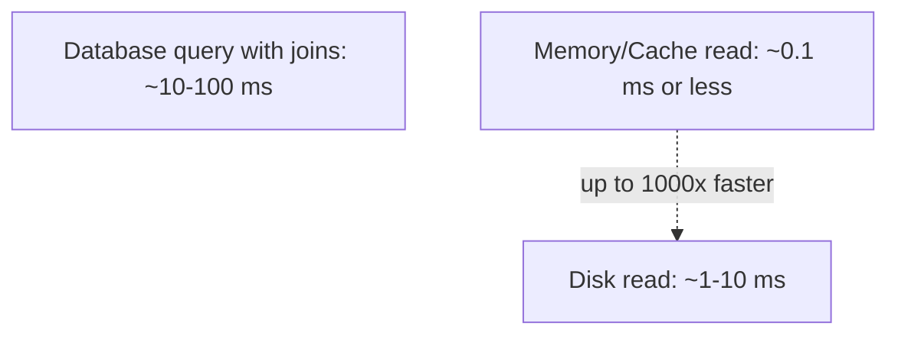

### The core reasons you need one
- **Speed** — serving from memory instead of hitting disk/DB on every request.
- **Reduced database load** — every request served by the cache is one less query hitting your database, which protects it from being overwhelmed.
- **Cost efficiency** — cheaper to serve repeat requests from a small in-memory cache than to keep scaling up the database to handle the same read volume.

### Without a cache

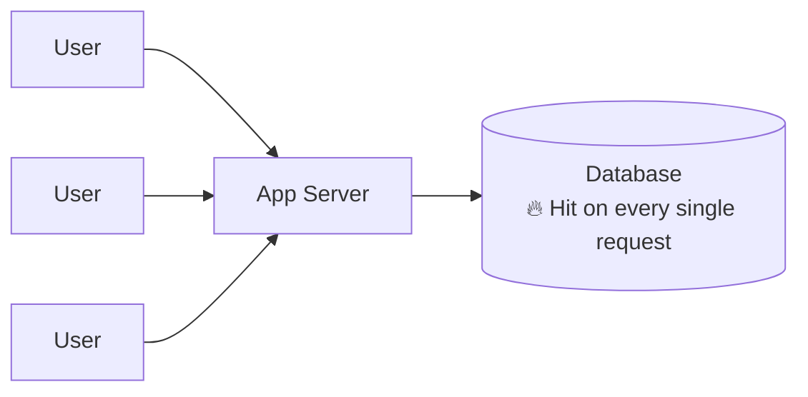

### With a cache

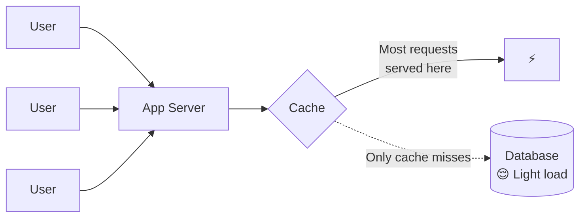

---

## 3. Where Caching Fits in a System

Caching isn't one single component — it can be applied at multiple layers of a system, each solving a different problem.

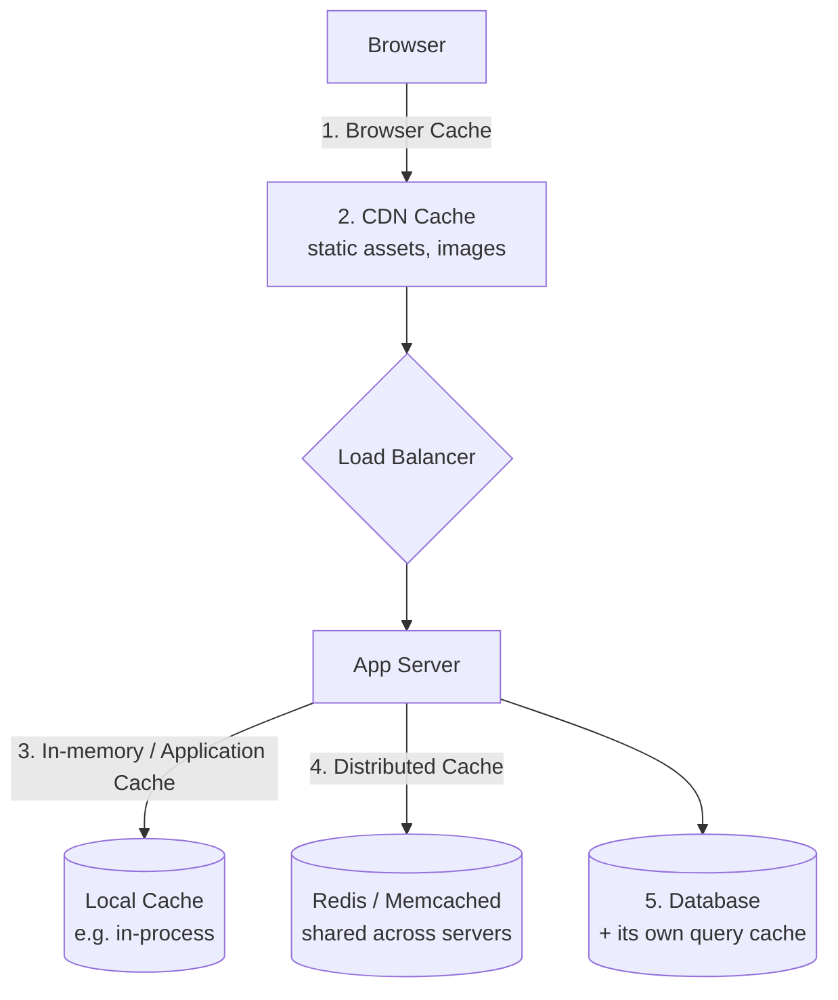

- **Browser cache** — the user's own browser stores assets locally (images, JS, CSS) so it doesn't re-download them.
- **CDN (Content Delivery Network)** — caches static content at servers geographically close to the user.
- **Application/in-memory cache** — data cached inside a single app server's own memory (fast, but not shared between servers — ties back to the "statelessness" problem from Day 1).
- **Distributed cache** (e.g., Redis, Memcached) — a shared cache all app servers can read from, which is why this is the most common choice in horizontally-scaled systems.
- **Database cache** — many databases have their own internal caching for frequently-run queries.

---

## 4. Caching Strategies (Read Patterns)

These define what happens when your app needs to **read** data — does it check the cache first, or the database?

### 4.1 Cache-Aside (a.k.a. Lazy Loading)
The most common pattern. The application code is responsible for checking the cache, and only going to the database on a miss.

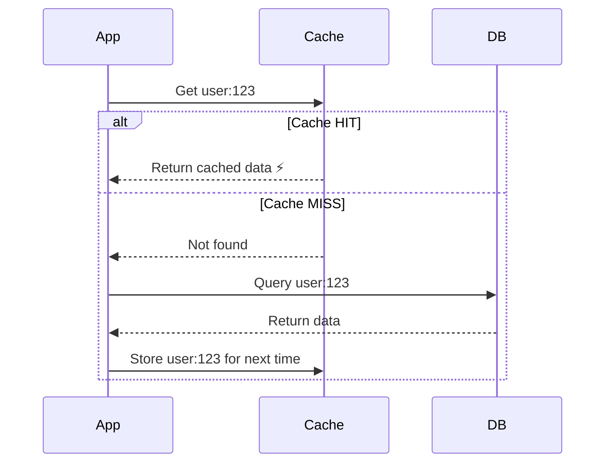

- **Good for:** general-purpose caching — you only cache what's actually being requested.
- **Downside:** the very first request for any piece of data is always slow (a cache miss) — this is called a "cold start."

### 4.2 Read-Through
Similar to Cache-Aside, but the **cache itself** (not the application) is responsible for going to fetch data from the database on a miss. The app only ever talks to the cache.

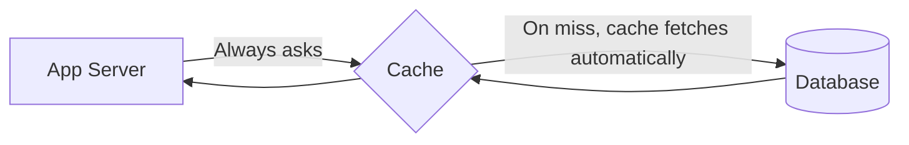

- **Good for:** simplifying application code — it never needs to know about the database directly for these reads.

---

## 5. Caching Strategies (Write Patterns)

These define what happens when your app needs to **write/update** data — does the cache get updated immediately, or later?

### 5.1 Write-Through
Every write goes to the cache **and** the database at the same time, before confirming success to the user.

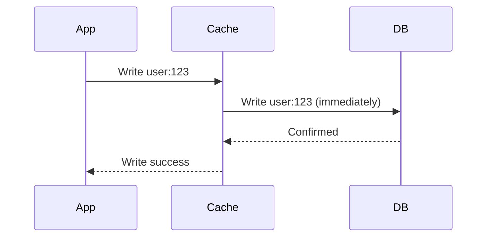

- **Good for:** data consistency — the cache is never stale, since it's always updated in lockstep with the DB.
- **Downside:** every write is now slightly slower, since it has to wait on both the cache and the database.

### 5.2 Write-Back (a.k.a. Write-Behind)
The write goes to the cache first, and the database gets updated **later**, asynchronously (in a batch, or after a delay).

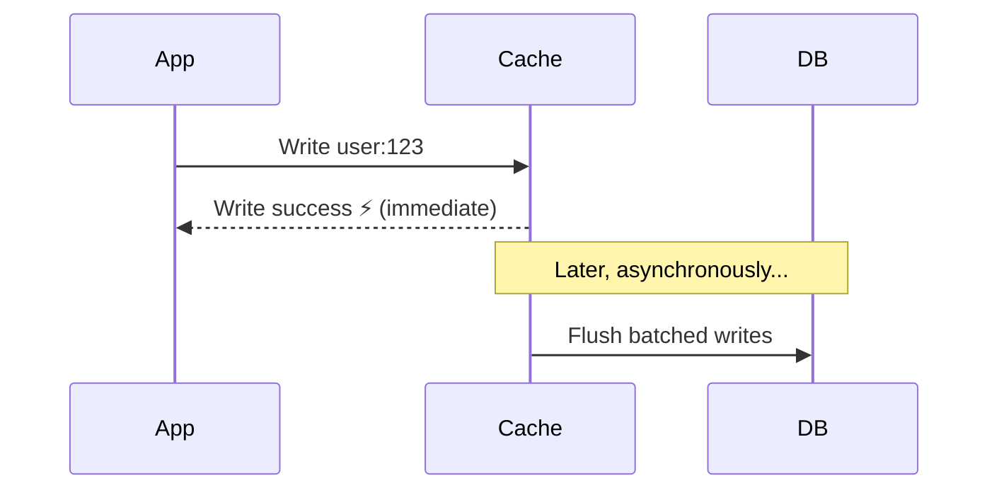

- **Good for:** very fast writes, and reducing database load by batching many writes together.
- **Downside:** risk of **data loss** if the cache crashes before it flushes to the database — the DB and cache can be temporarily out of sync.

### 5.3 Write-Around
The write goes directly to the database, **skipping** the cache entirely. The cache only gets populated later, on a subsequent read (via Cache-Aside).

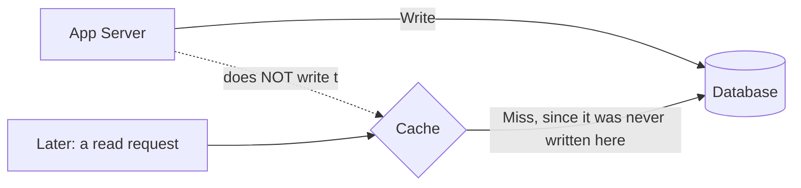

- **Good for:** data that's written often but rarely read again soon after (avoids cluttering the cache with data nobody will ask for).

### Strategy comparison

| Strategy | Write Speed | Consistency | Risk |
|---|---|---|---|
| Write-Through | Slower (waits for DB) | Strong — always in sync | None significant |
| Write-Back | Fast — immediate | Eventual — briefly out of sync | Data loss if cache crashes before flush |
| Write-Around | Fast for writes, first read is a miss | Consistent | Cold reads right after a write |

---

## 6. Eviction Policies — What Happens When the Cache Is Full

A cache is deliberately small (it lives in fast, expensive memory) — it **will** fill up. When that happens, the cache needs a rule for deciding what to throw out to make room for new data. This rule is the **eviction policy**.

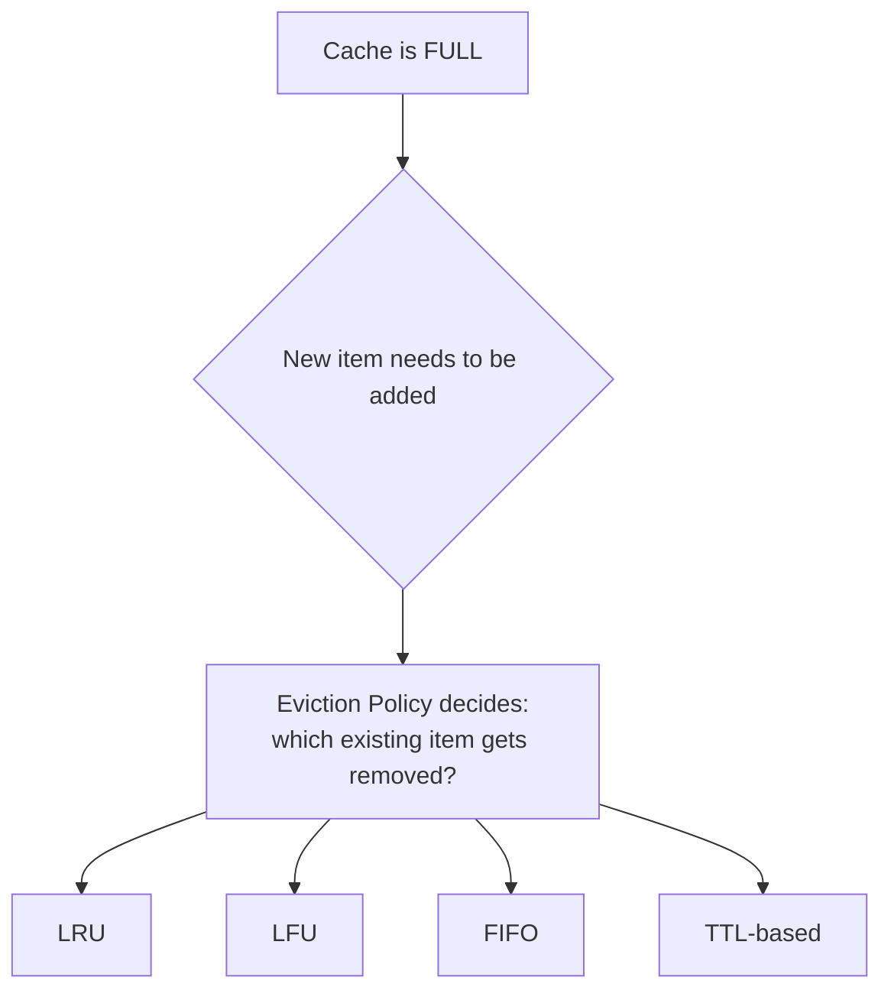

### Overview of common policies

| Policy | Full Name | Rule |
|---|---|---|
| **LRU** | Least Recently Used | Evict the item that hasn't been accessed for the longest time |
| **LFU** | Least Frequently Used | Evict the item that has been accessed the fewest total times |
| **FIFO** | First In, First Out | Evict the oldest item added, regardless of usage |
| **TTL** | Time To Live | Evict items automatically after a fixed expiry time, regardless of usage |

---

## 7. LRU Deep Dive

**LRU (Least Recently Used)** is the most widely used eviction policy in real systems, so it's worth understanding step by step.

### The idea
Keep track of the order in which items were last accessed. When the cache is full and a new item needs to come in, throw out whichever item was accessed **longest ago**.

### Step-by-step walkthrough
Assume a cache that can only hold **3 items**.

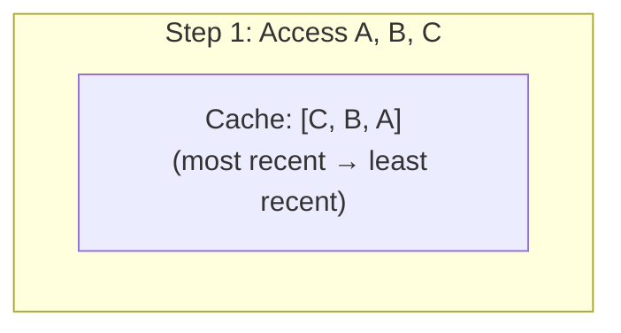

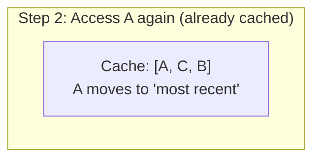

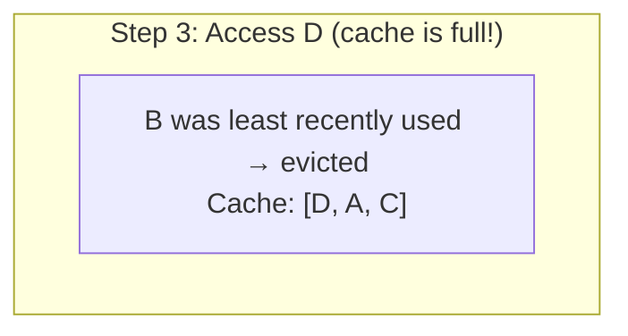

### As a diagram, the full flow

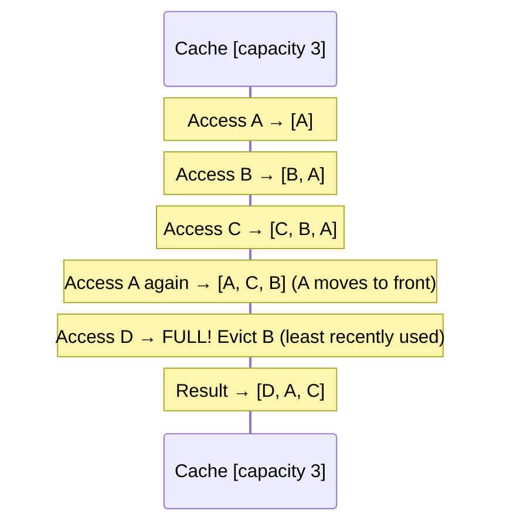

### How LRU is actually implemented
The classic, interview-favorite implementation combines two data structures for O(1) speed on every operation:

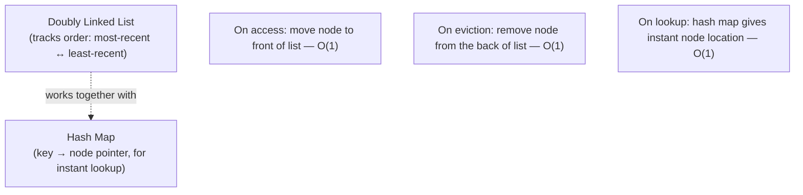

- The **hash map** gives you instant lookup of any item (no scanning needed).
- The **doubly linked list** keeps items ordered by recency, so the most-recently-used item is always at the front and the least-recently-used is always at the back — meaning eviction is just "chop off the back," an O(1) operation.

### Why LRU is popular
It's a good general-purpose heuristic: in most real workloads, data that was accessed recently is likely to be accessed again soon (this is called **temporal locality**). It's simple to implement and reason about.

### When LRU isn't ideal
LRU can be tricked by a one-time bulk scan — e.g., a batch job that reads through a huge dataset once floods the cache with items that will *never* be accessed again, evicting genuinely "hot" data in the process. In these cases, **LFU** (which tracks actual frequency of use, not just recency) can perform better.

---

## 8. The Big Risk: Stale & Inconsistent Data

Caching introduces a fundamental new problem: now there are **two copies** of the data (in the cache and in the database), and they can drift out of sync.

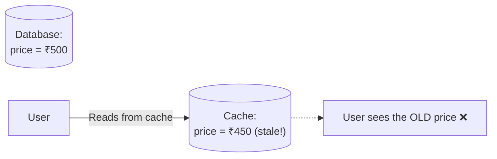

This is exactly why the **write strategy** you pick (Section 5) matters so much — it directly determines how long this staleness window can last, and how bad the consequences are if the cache and database ever disagree.

Common mitigations:
- **TTL (Time To Live):** force every cached item to expire after N seconds/minutes, guaranteeing it can't stay stale forever.
- **Explicit invalidation:** when data is updated, actively delete or update the corresponding cache entry immediately, rather than waiting for it to expire.

---

## 9. How to Reason About This in an Interview

If asked *"how would you speed up reads on this system?"*, a strong answer sounds like this:

> "I'd add a distributed cache like Redis in front of the database, using Cache-Aside as the default read pattern — the app checks the cache first, and only queries the database on a miss, then populates the cache for next time. For writes, if strong consistency matters — say, financial data — I'd use Write-Through so the cache and DB never disagree. If write volume is heavy and some staleness is tolerable, Write-Back would reduce database load by batching writes, accepting a small risk window. For eviction, I'd start with LRU since it's a solid general-purpose default backed by temporal locality, but if I noticed a batch job periodically flushing out my hot data, I'd consider switching to LFU for that specific cache. I'd also set a TTL as a safety net so nothing can go stale indefinitely, even if an invalidation gets missed somewhere."

That answer shows: you understand *why* caching helps, you can choose an *appropriate read/write strategy* based on the consistency needs of the data (not just naming one), you understand *eviction tradeoffs*, and you're aware of the *staleness risk* caching introduces.

---

## 10. Quick Recall Cheat Sheet

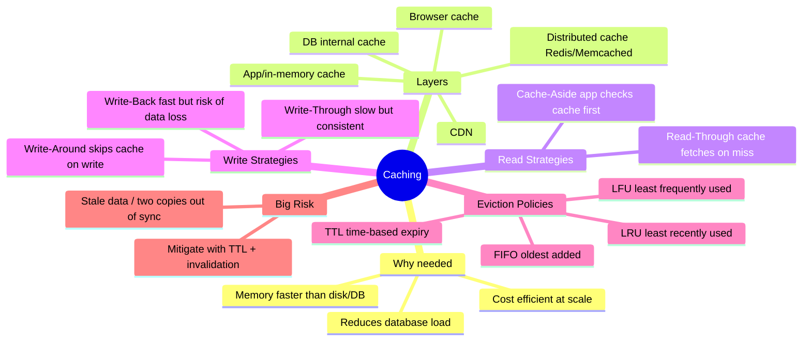

| If you remember only 5 things |
|---|
| 1. A cache is a small, fast layer that avoids repeating expensive work (like DB queries) by remembering the answer. |
| 2. Cache-Aside (app checks cache, falls back to DB on miss) is the most common read pattern. |
| 3. Pick your write strategy based on consistency needs: Write-Through for strong consistency, Write-Back for speed at the cost of some risk. |
| 4. LRU is the default eviction policy — evict whatever hasn't been used in the longest time — implemented with a hash map + doubly linked list for O(1) operations. |
| 5. Caching always introduces a staleness risk since you now have two copies of the data — TTLs and invalidation are how you keep that risk in check. |

---

*This file is written in GitHub-flavored Markdown with Mermaid diagrams — it will render natively on GitHub, GitLab, and most modern Markdown viewers.*
